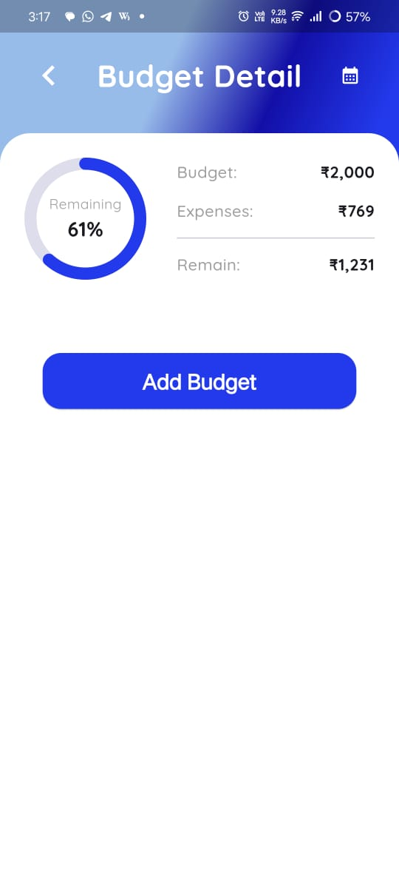

# 💸 MoneyTracker App
An MoneyTracker Android application 📱 built using Flutter 💙

---

## ❤️ Try App
### 📲 Scan QR Code
  


---

### 📦 Get APK
[Download here](https://drive.google.com/file/d/1zDhBn3uWEFVfadVqJLCWey7ZrHx0Ysdi/view?usp=drive_link)

---

## 🧾 MoneyTracker (Personal Finance App)
- Tech Stack: Flutter, Dart, SQLite, fl_chart, SharedPreferences
- A responsive and visually interactive expense tracking app designed to help users manage and analyze personal finances locally.
- A simple and efficient Flutter-based **Money Tracker** app that helps users manage daily expenses, income, loans, and borrowings. 
- The app stores all data locally using SQLite and provides clear visual insights through dynamic charts and summary tables. 
- Daily notifications remind you of your spending activity, keeping your financial habits in check.

---

## ✨ Features

- ✅ Add, edit, and delete transactions (expense, income, loan, borrow)
- 📅 Filter transactions by date and category
- 📊 Pie, bar and line charts for visual financial analysis
- 📈 Monthly balance table with income, expense, loan, borrow, and balance
- 🔍 Real-time search and category filter
- 🔔 Daily notification of min and max expenses using WorkManager
- 📦 Offline storage using SQLite (no internet required)
- 🎨 Clean, minimal UI with responsive layout

---

## 🛠 Tech Stack

| Technology | Purpose |
|-----------|---------|
| **Flutter** | UI development |
| **Dart** | Programming language |
| **SQLite (sqflite)** | Local data storage |
| **WorkManager** | Background task scheduling |
| **flutter_local_notifications** | Notifications |
| **fl_chart** | Pie and bar charts |
| **Provider** (or `setState`) | State management |

---


## 🧠 Use Cases

- **💼 Personal Finance Management**  
  Keep track of daily expenses, incomes, loans, and borrowings to maintain financial discipline.

- **📊 Budget Tracking**  
  Analyze your monthly spending habits using visual charts and summaries to adjust budgets and save more.

- **🎯 Goal-Oriented Saving**  
  Identify categories where you're overspending and make smarter financial decisions.

- **📅 Daily Expense Reminders**  
  Get timely notifications with daily expense highlights to stay aware of your spending activity.

- **📱 Offline Record Keeping**  
  Manage all financial records locally without any internet connection — perfect for on-the-go usage.

- **👪 Family or Shared Budgeting**  
  Useful for students, families, or small groups sharing expenses to record and review transactions transparently.

---

## 📬 Notifications
- This app uses WorkManager to trigger a background task every 12 hours. 
- If transactions are recorded for today, a notification will show the minimum and maximum expense.
- ⚠️ On Android 13+, notification permission is requested during runtime.

---

## 📸 Screenshots

|                                                 |                                                |                                                 |                                              |
|:-----------------------------------------------:|:----------------------------------------------:|:-----------------------------------------------:|:--------------------------------------------:|
|          |                |                  |  |
|  |  |  |    | 
|          |               |         |           |

---

---

## 🚀 Getting Started

### Prerequisites
- Flutter SDK installed
- Android Studio / VS Code
- Emulator or physical Android device

### Clone the project
```bash
git clone https://github.com/your-username/money-tracker-app.git
cd money-tracker-app
